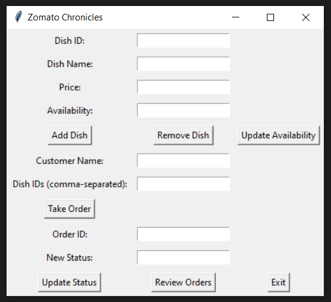

# Zomato-Chronicles-The-Great-Fiasco-using-Python

### Table of Contents
1. Introduction
2. Features
3. MVC Structure
4. Step-by-Step Explanation
5. Conclusion

### This is how to message-box using tkinter looks like

### 1. Introduction
The "Zomato Chronicles: The Great Food Fiasco" application is a command-line system developed using Python and incorporates core programming concepts such as conditional statements, loops, lists, and dictionaries. The application aims to help Zesty Zomato, a restaurant in Mumbai, manage their food delivery service more effectively and efficiently. The application allows Zesty Zomato staff to manage their menu, take orders from customers, update order status, and review all orders.

### 2. Features
The key features of the "Zomato Chronicles: The Great Food Fiasco" application include:

- **Menu Mastery**: The application enables Zesty Zomato to manage their menu of dishes. Each dish has unique attributes such as dish ID, dish name, price, and availability.
- **User Interaction Euphoria**: Zesty Zomato staff can perform various tasks, including adding new dishes to the menu, removing dishes, updating dish availability, taking customer orders, updating order status, and reviewing all orders.
- **Taking Orders**: When a customer places an order, Zesty Zomato staff can enter the customer's name and the dish IDs. The system checks the availability of each dish and processes the order accordingly.
- **Order Updates**: Staff can update the status of an order as it progresses from 'received' to 'preparing', 'ready for pickup', and 'delivered'.
- **Edge Case Excellence**: The application handles edge cases such as invalid inputs and ordering dishes that don't exist or aren't available.

### 3. MVC Structure
The "Zomato Chronicles" application follows the Model-View-Controller (MVC) architectural pattern, which separates the application into three interconnected components:

- **Model**: The model represents the data and business logic of the application. In this case, the model consists of the menu (list of dishes) and orders (dictionary of order details).
- **View**: The view handles the presentation of the data to the user. In this application, the view is implemented using the Tkinter library to provide a graphical user interface (GUI) for the user to interact with.
- **Controller**: The controller acts as an intermediary between the model and the view, handling user input, triggering appropriate actions, and updating the model and view accordingly. In this application, the controller is implemented using functions that correspond to different actions in the GUI.

### 4. Step-by-Step Explanation
Here's a step-by-step explanation of how the features of the "Zomato Chronicles" application work:

1. The application starts by loading the menu and orders data from a JSON file using the `load_data()` function. If the file doesn't exist, the application proceeds with an empty menu and orders.

2. The GUI is created using the Tkinter library, providing a user-friendly interface for Zesty Zomato staff to interact with.

3. The staff can add a new dish to the menu by entering the dish ID, dish name, price, and availability in the respective entry fields. Clicking the "Add Dish" button triggers the `add_dish()` function. The function retrieves the input values, creates a dish dictionary, adds it to the menu list, and saves the updated data to the JSON file.

4. Similarly, staff can remove a dish from the menu by entering the dish ID and clicking the "Remove Dish" button. The `remove_dish()` function is called, which searches for the dish in the menu list,

removes it if found, and saves the updated data to the JSON file.

5. To update the availability of a dish, staff can enter the dish ID and the new availability status (yes or no) in the respective entry fields. Clicking the "Update Availability" button triggers the `update_availability()` function. The function searches for the dish in the menu list, updates its availability, and saves the updated data to the JSON file.

6. When a customer places an order, staff can enter the customer's name and the dish IDs (comma-separated) in the respective entry fields. Clicking the "Take Order" button triggers the `take_order()` function. The function checks the availability of each dish in the menu, adds the available dishes to an order dictionary, assigns a unique order ID, and saves the order details to the orders dictionary. The data is then saved to the JSON file.

7. Staff can update the status of an order by entering the order ID and the new status in the respective entry fields. Clicking the "Update Status" button triggers the `update_order_status()` function. The function searches for the order in the orders dictionary, updates its status, and saves the updated data to the JSON file.

8. The staff can review all the orders by clicking the "Review Orders" button. This triggers the `review_orders()` function, which displays a message box showing the order details, including the order ID, customer name, dishes, and status.

9. Finally, staff can exit the application by clicking the "Exit" button. This triggers the `exit_program()` function, which saves the data to the JSON file, displays a farewell message, and closes the GUI window.

### 5. Conclusion
The "Zomato Chronicles: The Great Food Fiasco" application provides Zesty Zomato with a user-friendly command-line system to manage their food delivery service effectively. With features such as menu management, order taking, order status updates, and order review, the application helps streamline Zesty Zomato's operations. By following the MVC structure, the application separates concerns and ensures maintainability and scalability.

Please note that the provided code and documentation are for illustration purposes. Additional error handling, input validation, and user interface enhancements can be implemented as per the specific requirements of Zesty Zomato.

If you have any further questions or need assistance, feel free to ask!
